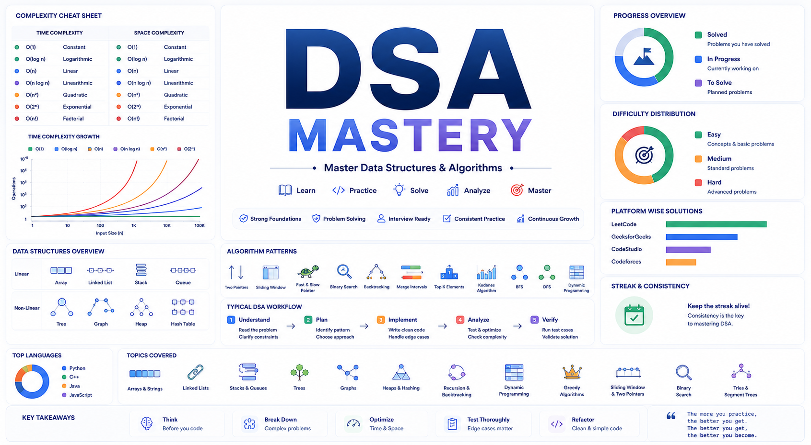

# DSA Mastery

> This repository documents my journey to mastering Data Structures and Algorithms (DSA). It contains solutions to coding problems, detailed explanations, algorithmic patterns, complexity analysis, and personal notes.

## Goals

- Build strong problem-solving skills
- Master core and advanced DSA concepts
- Develop interview-ready coding proficiency
- Maintain consistency through daily practice

## Topics Covered

- Arrays & Strings
- Linked Lists
- Stacks & Queues
- Trees & Graphs
- Heaps & Hashing
- Recursion & Backtracking
- Dynamic Programming
- Greedy Algorithms
- Sliding Window & Two Pointers
- Binary Search
- Tries & Segment Trees

Progress is tracked continuously as I solve and document new problems.
