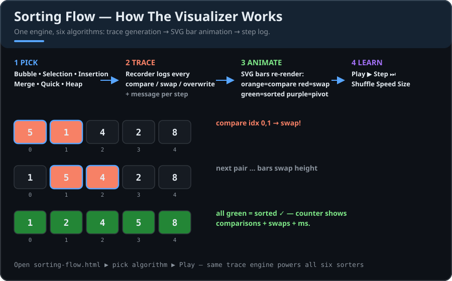

# ⚡ AlgoVision DSA Lab — Enhanced DSA Visualization Hub

> Enhanced upgrade of "DSA Visualization": top-10 algorithms as **how-it-works SVG diagrams** + a **working sorting-algorithms flow lab** (play / pause / step / shuffle, pure SVG bars, zero dependencies).



## Open it

No build step — just open in a browser:

| File | What it is |
|---|---|
| `index.html` | Hub landing page — all 10 algorithm cards |
| `sorting-flow.html` | **Working playground**: 6 sorters animated as SVG bars |
| `svg/*.svg` | 10 standalone how-it-works diagrams (open directly in browser) |

```bash
# from repo root
start algovision-dsa-lab\index.html        # Windows
open algovision-dsa-lab/index.html         # macOS
xdg-open algovision-dsa-lab/index.html     # Linux
# or serve:  python -m http.server 8000  →  http://localhost:8000/algovision-dsa-lab/
```

## Top 10 algorithms (each has an SVG)

| # | Algorithm | SVG | Complexity |
|---|---|---|---|
| 1 | Bubble Sort | `svg/01-bubble-sort.svg` | O(n²), S O(1), stable |
| 2 | Selection Sort | `svg/02-selection-sort.svg` | O(n²), S O(1) |
| 3 | Insertion Sort | `svg/03-insertion-sort.svg` | O(n)→O(n²), S O(1), stable |
| 4 | Merge Sort | `svg/04-merge-sort.svg` | O(n log n), S O(n), stable |
| 5 | Quick Sort | `svg/05-quick-sort.svg` | ~O(n log n), S O(log n) |
| 6 | Heap Sort | `svg/06-heap-sort.svg` | O(n log n), S O(1) |
| 7 | Binary Search | `svg/07-binary-search.svg` | O(log n) |
| 8 | BFS | `svg/08-bfs.svg` | O(V+E) |
| 9 | DFS | `svg/09-dfs.svg` | O(V+E) |
| 10 | Dijkstra | `svg/10-dijkstra.svg` | O((V+E) log V) |

Plus `svg/sorting-flow-overview.svg` — the 4-stage pipeline diagram (Pick → Trace → Animate → Learn).

## Sorting Flow Lab — how it works

```
choose algorithm → trace generator records every
compare / swap / overwrite + message → SVG bar
renderer replays steps (orange=compare, red=swap,
purple=pivot/key, green=sorted)
```

Controls: **Play/Pause · Step · Back · Reset · Shuffle · Speed · Size** (+ `Space` / arrow-key shortcuts). Side panel shows comparisons, swaps/writes, trace-build ms, pseudocode, and a scrolling step log.

## Structure

```
algovision-dsa-lab/
├── index.html            # hub
├── sorting-flow.html     # working visualizer (offline, no deps)
├── README.md
└── svg/
    ├── 01-bubble-sort.svg … 10-dijkstra.svg
    └── sorting-flow-overview.svg
```
